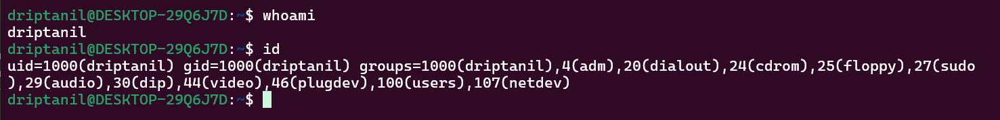
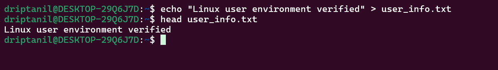
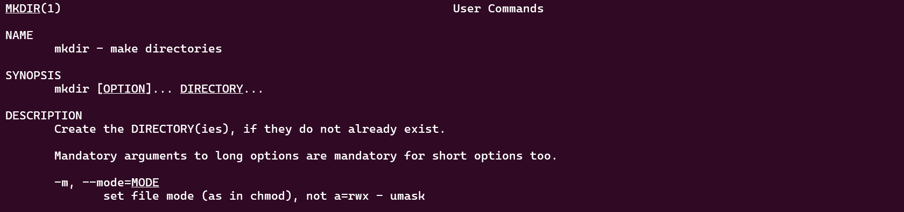
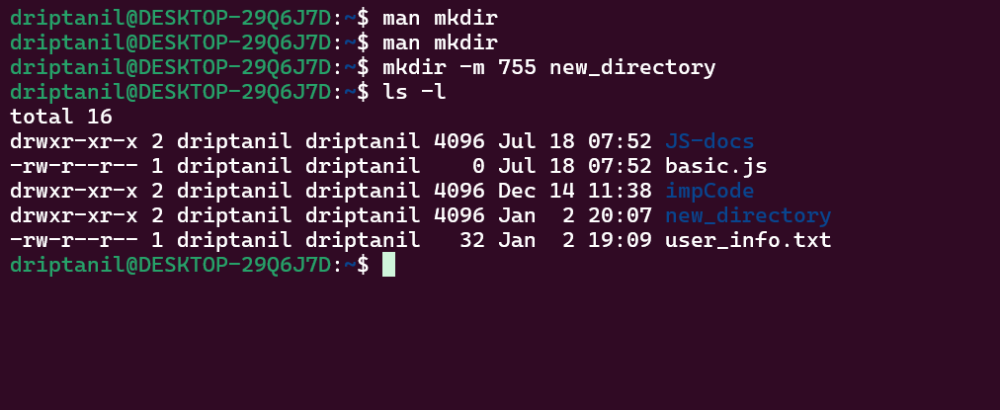
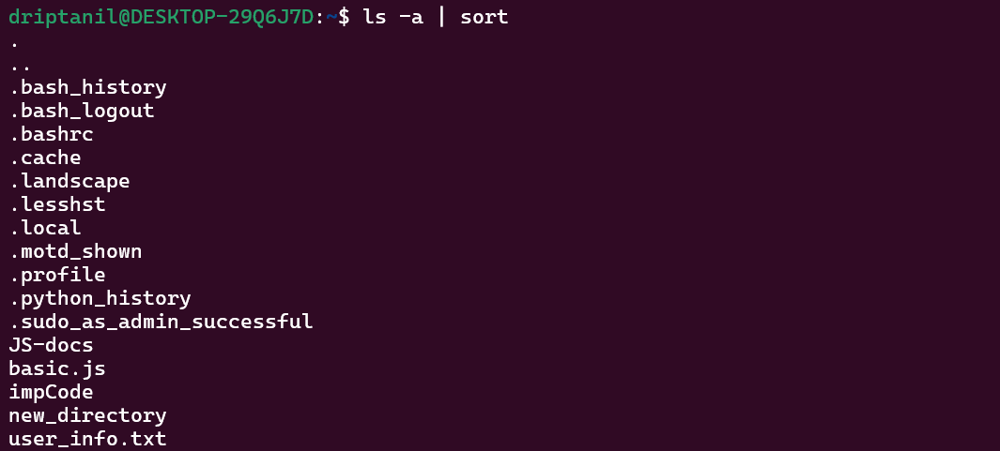
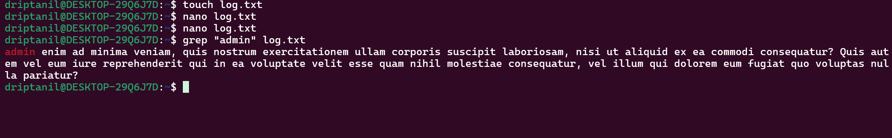
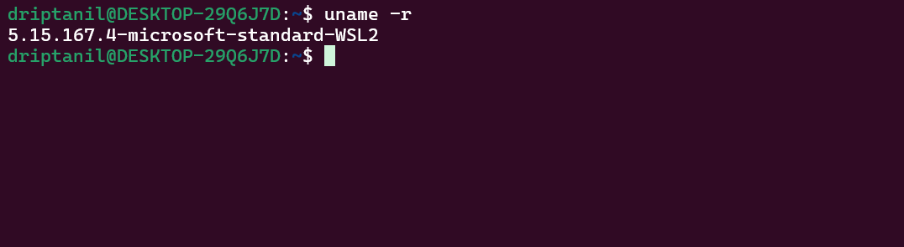
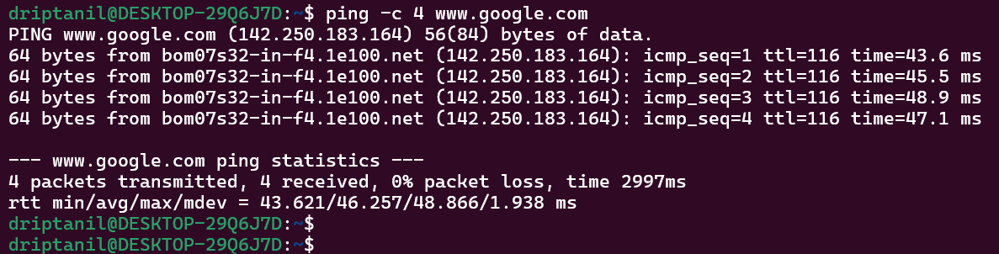
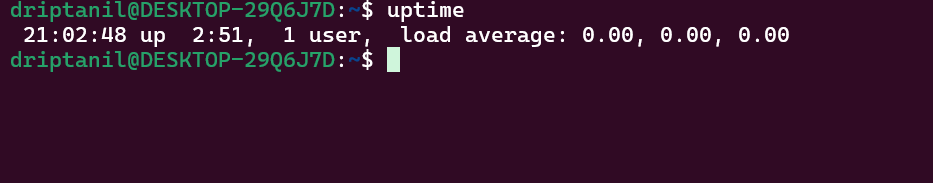

# Question 1

### 1. User Identity Verification

$`whoami`
 - whoami is used to check the which user is currently logged in

$`id`
 - id is used to check user ID as well the groups which the user belongs and their relevent IDs. 

---
### 2. Workspace Validation

$`pwd`

 - pwd is used to print the present working directory

$`ls -l`

 - ls -l is used to show all files and directory in the current directory in long format

---
### 3. Environment Confirmation File

$`echo "Linux user environment verified" > user_info.txt`

 - echo is used to simply used to print to the standard output. With > implemented in the command
 - we can save the line /text on file if it already exists. If it doesn't exist. A new file will be created.

[user_info.txt](user_info.txt)

---
### 4. File Integrity Check

$`wc -m user_info.txt`

- wc is used for counting -m flag especially counts all the characters in a file

---
### 5. Learning the tools

$`man mkdir`
 - man will reveal the manual of mkdir command

$`mkdir -m 775 new_directory`
 - -m flag is used to set permission for that repository
 - 775 will give **owner** and **group** the permission to read write and execute and **other** to read and write

---
### 6. Home Directory Inspection

$`ls -a | sort`

or

$`ls -a ~`

 - ls -a will list all the files and directory and **sort** will sort out it in alphabetical order

---
### 7. Log Investigation

$`grep "admin" log.txt`

 - grep will find out and print the line with admin 

[Log.txt](log.txt)

---
### 8. System Information Check

$`uname -r`

 - the -r flag displays the current kernel version
 - using WSL so its like that

---
### 9. Network Connectivity Test

$`ping -c 4 www.google.com`

 - The ping cmd is used to test network connectivity
 - ping will send ICMP packets continuously and to send exactly 4 packets we have to use the **-c** flag with 4 as argument

---
### 10.  System Health Awareness

$`uptime`

 - uptime shows how long the system has been running (2:51 hrs)
 - the number of logged in users (just me)
 - load avg (0.00, 0.00, 0.00 shows the system is in idle mode)

---

